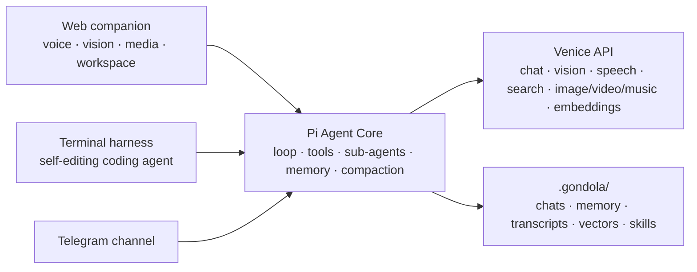

<p align="center">
  
</p>

<h1 align="center">Gondola</h1>

<p align="center">
  A voice and vision AI companion, and a self-editing terminal coding harness, powered entirely by <a href="https://venice.ai">Venice AI</a> and orchestrated by Pi Agent Core.
</p>

<p align="center">
  
  
  
</p>

Gondola is two front ends over one agent core. The **web companion** is a voice and vision chat with an animated presence, a media tray, a workspace, and scheduled automations. The **terminal harness** is a coding agent that reads, writes, edits, and runs code in its working directory, so pointed at its own repo it can improve itself. Every model capability runs through Venice; everything you say and do stays local.

## Capabilities

| | Capability | What it does |
| --- | --- | --- |
| 🎙 | **Voice** | Hands-free mode with automatic end-of-turn detection. Venice speech-to-text, then the agent, then streaming Venice speech, so it starts talking before the full answer is ready. Interrupt anytime. |
| 👁 | **Vision** | Samples webcam frames to notice gestures, expressions, and things you hold up. Observations arrive as notes in text mode and are only spoken during a voice session. |
| 🔎 | **Semantic search** | Finds past conversations by meaning, not just titles. Chunk-level Venice embeddings (indexed the way Cursor indexes a codebase) with hybrid lexical re-ranking, so a name mentioned once mid-chat still surfaces. |
| 🧠 | **Model selection** | Pick any Venice model per conversation from the composer. Automatic fallback if one is unavailable, and reasoning models can stream a collapsible thinking trace. |
| 🧩 | **Coding sub-agents** | Delegate a self-contained coding or research task to a scoped worker that can read, write, and edit files, with a live task card showing each tool it uses. |
| 🎨 | **Media creation** | Generate images, video, and music through Venice, collected in an in-app tray. Expensive jobs are quoted first and confirmed. |
| 💾 | **Memory** | Typed, local long-term memory (bio, preferences, projects, relationships, and more) with optional auto-capture and an approval workflow you control. |
| ⏰ | **Automations** | Schedule prompts that run on their own cadence with no tab open, delivering the result to the chat or to Telegram. |
| 🔌 | **Connections** | One-click MCP integrations (Gmail, Calendar, Slack, Notion, GitHub, Linear) or any custom MCP server, plus a Telegram channel. |
| 📟 | **API X-ray** | A live trace of every Venice call with latency, tokens, and the exact per-request cost derived from the model's list pricing. |
| 🛠 | **Self-editing harness** | Run it in any project directory and it becomes a general coding agent; run it in this repo and it edits its own source. |

## Screenshots

The hero above is illustrative. Real UI captures live in [`docs/screenshots/`](docs/screenshots) and are wired into this section as they land. Contributions welcome, see the guide in that folder.

## Quick start

Requirements: **Node.js 20+** and a **Venice inference API key**.

```bash
git clone https://github.com/sabrinaaquino/gondola.git
cd gondola
npm install --ignore-scripts
cp .env.example .env.local   # then add your VENICE_API_KEY
```

On first run, Gondola shows a guided setup that verifies your Venice key and turns on capabilities. Developers can skip it by adding a key to `.env.local` as above.

Run the web companion:

```bash
npm run dev            # open the local URL it prints
```

Run the terminal harness (operates on the current working directory):

```bash
npm run harness        # or `nova` after `npm link`
```

Slash commands: `/help`, `/model [id]`, `/models`, `/tools`, `/cwd`, `/reset`, `/clear`, `/exit`. Ctrl-C aborts a turn, twice to exit.

`.env.example` documents two optional, server-only keys: `VENICE_ADMIN_KEY` (surfaces balance and usage analytics in the API X-ray) and `TELEGRAM_BOT_TOKEN` (enables the Telegram channel, which you can also paste in the UI).

## Architecture



- **Web companion** (`src/app/`): the browser handles UI, webcam/mic, and audio; local Next.js API routes keep the Venice key private and stream agent events as newline-delimited JSON.
- **Terminal harness** (`src/cli/`, launched by `bin/nova.mjs`): a Pi `Agent` loop over Pi's sandboxed working-directory filesystem and shell, running on Node via `tsx`.
- Both share `src/lib/` (Venice client, memory, model and stream setup, skills, MCP, sub-agents, search, compaction).
- **Pi Agent Core** orchestrates the loop, tools, memory, and compaction. It does not replace Venice; every capability goes through the Venice API.

## Privacy and safety

- Conversations, agents, memory, skills, connections, automations, and generated media persist locally under `.gondola/` (git-ignored). Your inference key stays on the server and never ships to the browser.
- The harness runs shell commands and edits files autonomously; destructive actions require confirmation, and it is instructed never to touch secrets. Run it on code under version control and review its diffs.
- This is a local, single-user tool, not a hardened multi-tenant deployment.

## Contributing

Issues and pull requests are welcome. See [CONTRIBUTING.md](./CONTRIBUTING.md) and our [Code of Conduct](./CODE_OF_CONDUCT.md). The product and implementation plan lives in [PLAN.md](./PLAN.md).

## License

[MIT](./LICENSE) © Sabrina Aquino
